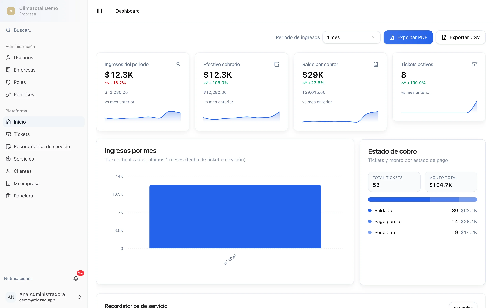
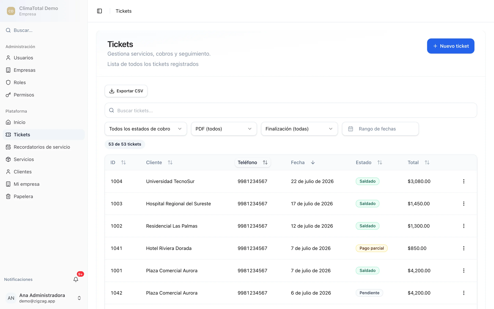
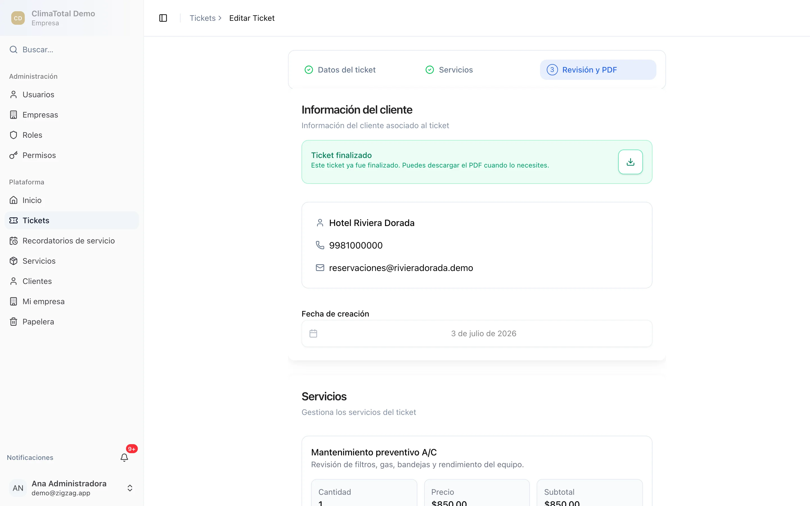
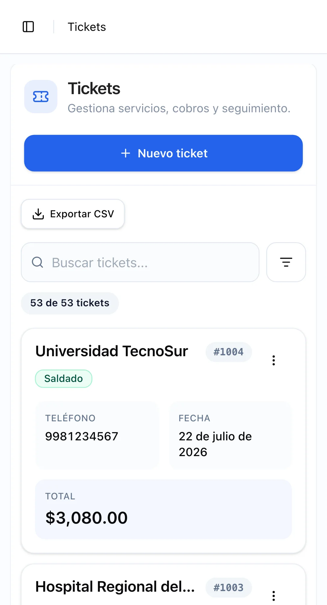
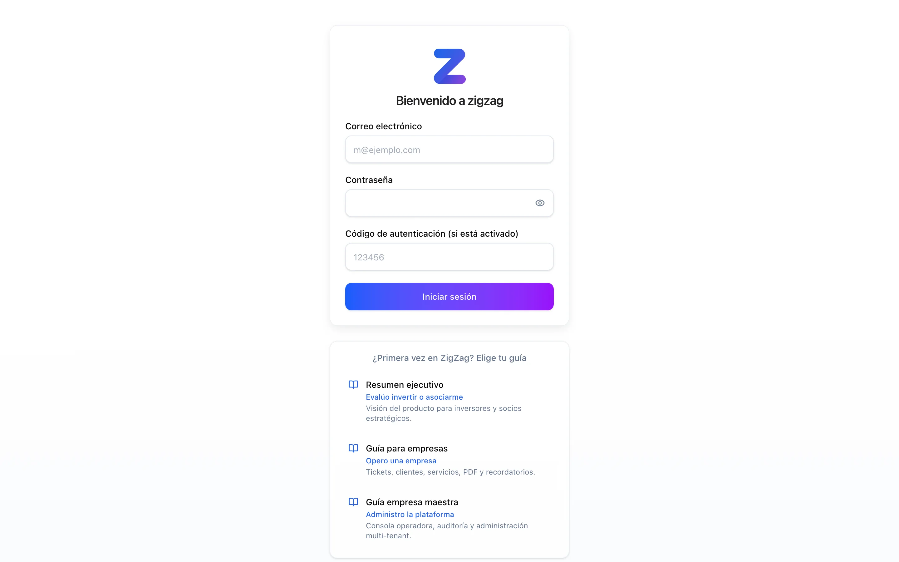
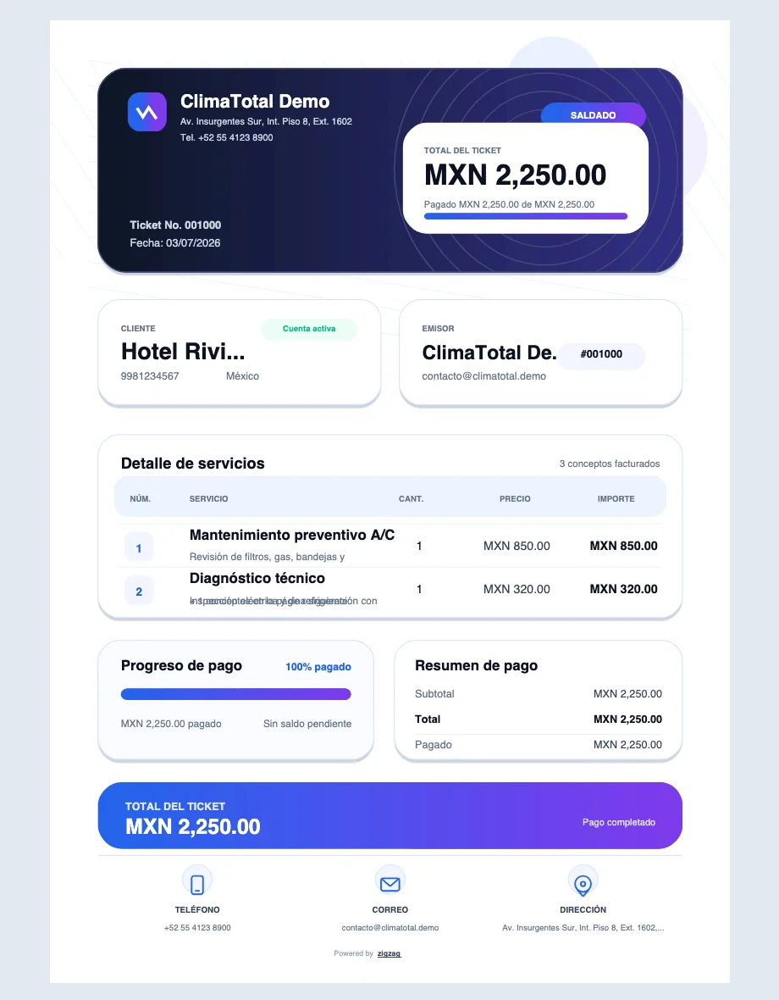
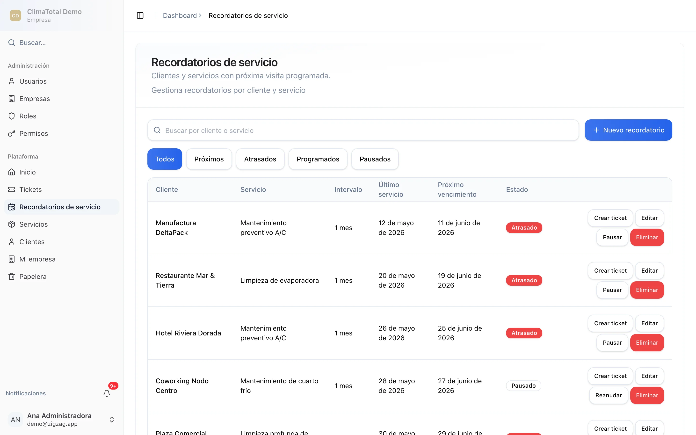

# ZigZag — Ticket Management System

[](https://github.com/Jorg3L3on/zigzag/actions/workflows/ci.yml)
[](LICENSE)
[](https://nextjs.org/)
[](https://orm.drizzle.team/)
[](https://www.postgresql.org/)

<p align="center">
  
</p>

Multi-tenant ticket management built with **Next.js 16**, **Drizzle ORM**, and **PostgreSQL**.

**[Live demo](https://zigzag-hazel.vercel.app)** · [Product guides](https://zigzag-hazel.vercel.app/guides/) · [Contributing](CONTRIBUTING.md) · [Security](SECURITY.md)

<p align="center">
  
</p>

## Screenshots

| Tickets | Ticket detail | Mobile |
| :-----: | :-----------: | :----: |
|  |  |  |

| Login | Invoice PDF | Service reminders |
| :---: | :---------: | :---------------: |
|  |  |  |

More walkthroughs (tenant + system operator): [live guides](https://zigzag-hazel.vercel.app/guides/) · source under [`docs/guides/`](docs/guides/).

## Features

- Multi-tenant data isolation by company
- Role-based permissions
- Tickets, clients, and service catalog
- Dashboard metrics and **server-generated** ticket invoices (PDF)
- Mobile-friendly UI (responsive lists, touch targets, accessibility)
- Installable PWA (`start_url` → `/dashboard`; service worker caches app shell; Ticket data requires internet)
- UI with shadcn/ui and Tailwind CSS

## Tech stack

| Layer | Choice |
|-------|--------|
| Framework | Next.js 16 (App Router, Turbopack dev on port **3069**) |
| Database | PostgreSQL + Drizzle ORM |
| Auth | NextAuth v5 (Credentials, JWT sessions) |
| Forms | React Hook Form + Zod |
| Tests | Jest, React Testing Library, Playwright (`e2e/`) |

## Prerequisites

- **Node.js 20.9+**
- **PostgreSQL 14+** (local, Docker, or hosted)
- npm

## Getting started

```bash
git clone https://github.com/Jorg3L3on/zigzag.git
cd zigzag
npm install
```

Copy [`.env.example`](.env.example) to `.env` (or `.env.local`) and set at least:

- `DATABASE_URL` — PostgreSQL URL (database name **`zigzag`** in examples)
- `DIRECT_URL` — optional locally; use Neon direct URL in production for migrations
- `NEXTAUTH_URL` — `http://localhost:3069` for local dev
- `NEXTAUTH_SECRET` or `AUTH_SECRET` — random secret (`openssl rand -base64 32`)

```bash
npm run db:generate   # after schema changes in src/db/schema.ts
npm run db:migrate    # apply migrations
npm run seed          # optional seed data
npm run dev           # http://localhost:3069
```

## Scripts

| Command | Purpose |
|---------|---------|
| `npm run dev` | Dev server (Turbopack, port 3069) |
| `npm run build` | Production build |
| `npm start` | Production server (port 3069) |
| `npm run lint` | ESLint |
| `npm run db:generate` | Generate SQL migrations |
| `npm run db:migrate` | Apply migrations locally |
| `npm run migrate:deploy` | Apply migrations in production (`DIRECT_URL` when set) |
| `npm run db:studio` | Drizzle Studio |
| `npm run seed` | Seed via `scripts/seed.ts` |
| `npm run db:prod:setup` | `migrate:deploy` + seed (first-time prod only) |
| `npm test` | Jest unit/integration tests |
| `npm run test:watch` | Jest watch mode |
| `npm run test:coverage` | Coverage report |
| `npm run test:e2e` | Playwright E2E (desktop + mobile projects) |
| `npm run test:e2e:mobile` | Playwright mobile project only (`Pixel 5`) |

## Project layout

```
src/
├── actions/       # Server Actions (primary mutations)
├── app/           # App Router pages and API routes
├── components/    # UI components
├── contexts/      # React context (e.g. company selection)
├── db/            # Drizzle schema
├── lib/           # Auth, DB client, errors, security
├── proxy.ts       # Route protection for / and /dashboard/**
└── types/
drizzle/           # SQL migrations
scripts/seed.ts    # Seed script
docs/              # Production runbook and ops notes
```

Contributor and architecture details: **[AGENTS.md](AGENTS.md)**. PRD → issues → PR workflow: **[docs/agents/workflow.md](docs/agents/workflow.md)** · **[CONTRIBUTING.md](CONTRIBUTING.md)**.

Optional RAG tooling over internal docs: **[rag/README.md](rag/README.md)** (`npm run rag:index`, `rag:search`, `rag:ask`).

## Testing

```bash
npm test
npm run test:e2e
```

CI-style Jest: `npm test -- --runInBand`.

Playwright runs **two projects**: `chromium` (Desktop Chrome) and `mobile-chrome` (Pixel 5 profile). By default it builds and starts a **production server on port 3070** (same as CI). Turbopack dev (`npm run dev`) incorrectly 404s on `/tickets*` routes; use `PLAYWRIGHT_USE_DEV=1` only if you accept that limitation.

The smoke suite includes an unauthenticated redirect test; authenticated tests run when credentials are set:

```bash
export E2E_EMAIL="your-user@example.com"
export E2E_PASSWORD="your-password"
npm run test:e2e
```

Mobile-only (faster iteration):

```bash
npm run test:e2e:mobile
```

Manual device checks before release: [tasks/mobile-release-checklist.md](tasks/mobile-release-checklist.md). Mobile PRD index: [tasks/INDEX.md](tasks/INDEX.md).

## Mobile & PWA

Install ZigZag on a phone or tablet for quick access from the home screen. After install, the app opens on the **Dashboard** (`/dashboard`). If your session expired, sign in again.

**Internet required for writes:** A service worker caches the **app shell** (UI, static assets) so the installed app can load offline after one online visit. Ticket and client lists keep read-only device snapshots after a successful online load, with a last-updated banner when shown offline. **Services and saves still require a live connection** — there is no offline sync or offline CRUD.

### Español

**Instalar en iPhone (Safari)**

1. Abre ZigZag en Safari.
2. Toca **Compartir** → **Añadir a pantalla de inicio**.
3. Confirma el nombre **ZigZag** y toca **Añadir**.

**Instalar en Android (Chrome)**

1. Abre ZigZag en Chrome.
2. Toca el menú → **Instalar app** o **Añadir a pantalla de inicio** (según el dispositivo).
3. Confirma la instalación.

Tras instalar, la app abre en el **Panel** (`/dashboard`). Si la sesión expiró, inicia sesión de nuevo.

**Conexión para guardar:** un service worker guarda la **cáscara de la app** (interfaz y recursos estáticos) para que la app instalada pueda abrirse sin red tras una visita en línea. Las listas de tickets y clientes conservan copias locales solo lectura después de una carga exitosa en línea y muestran la última actualización si aparecen sin conexión. **Servicios y guardados siguen requiriendo internet** — no hay sincronización ni edición offline.

**Probar en la red local (opcional):** con `npm run dev` en el puerto **3069**, abre `http://<tu-ip>:3069` desde el teléfono en la misma Wi‑Fi.

Antes de un release móvil, usa la checklist manual: [tasks/mobile-release-checklist.md](tasks/mobile-release-checklist.md).

### English

**Install on iPhone (Safari)**

1. Open ZigZag in Safari.
2. Tap **Share** → **Add to Home Screen**.
3. Confirm the name **ZigZag** and tap **Add**.

**Install on Android (Chrome)**

1. Open ZigZag in Chrome.
2. Tap the menu → **Install app** or **Add to home screen** (wording varies by device).
3. Confirm the install.

After install, the app opens on the **Dashboard** (`/dashboard`). Sign in again if your session expired.

**Writes require internet:** a service worker caches the **app shell** (UI and static assets) so the installed app can load offline after one online visit. Ticket and client lists keep read-only device snapshots after a successful online load, with a last-updated banner when shown offline. **Services and saves still need a live connection** — no offline sync or offline CRUD.

**Test on your LAN (optional):** with `npm run dev` on port **3069**, open `http://<your-ip>:3069` from your phone on the same Wi‑Fi.

Before a mobile release, use the manual checklist: [tasks/mobile-release-checklist.md](tasks/mobile-release-checklist.md).

### Supported browsers / Navegadores compatibles

| Platform | Supported |
|----------|-----------|
| iOS | Safari (last 2 major versions) |
| Android | Chrome (last 2 major versions) |
| Desktop | Chrome, Edge (current versions) |

**English:** Ticket PDFs are generated on the server in v1. If download fails on iOS, retry on Wi‑Fi or contact your administrator.

**Español:** Los recibos PDF se generan en el servidor en v1. Si la descarga falla en iOS, reintenta con Wi‑Fi o contacta al administrador.

## Deployment (Vercel + Neon)

Use [`.env.production.example`](.env.production.example) for production variables. Full checklist, rollback, and incidents: **[docs/production-runbook.md](docs/production-runbook.md)**. Branch strategy: **[docs/agents/deployment.md](docs/agents/deployment.md)**.

**Only `main` deploys.** `vercel.json` sets `git.deploymentEnabled` so pushes and PRs from other branches do **not** create Vercel preview builds. Smoke-test locally (`npm run build` / Playwright) before merging to `main`.

Summary:

1. In Vercel **Production** env, set at least:
   - `DATABASE_URL` (pooled), `DIRECT_URL` (direct)
   - `NEXTAUTH_URL`, `NEXTAUTH_SECRET` / `AUTH_SECRET`
   - `BLOB_READ_WRITE_TOKEN` — from a **public** Vercel Blob store (required for company logo uploads; private stores fail with public `access`)
   - `CRON_SECRET` — for `/api/cron/notifications` (see `vercel.json` crons)
2. Production builds run `npm run vercel-build` (`migrate:deploy` then `next build`).
3. Optionally run `npm run db:prod:setup` once for seed data on a fresh database.
4. Merge to `main` (or deploy Production); smoke-test `/api/health`, login, and a clients/services/tickets flow. Try a logo upload if branding matters.

Pre-merge locally: `npm run lint`, `npm test`, `npm run build` (and `npm run test:e2e` when touching UI).

## Troubleshooting

| Issue | Check |
|-------|--------|
| DB connection | `DATABASE_URL`, Postgres running, database `zigzag` exists |
| Auth / redirects | `NEXTAUTH_URL` matches deployed URL; secret is set |
| Logo upload **CO014** | Set `BLOB_READ_WRITE_TOKEN` in Vercel Production and redeploy |
| Logo upload **CO010** / private store | Blob store must be **public**; recreate/link a public store and update the token |
| Cron notifications | `CRON_SECRET` set; schedule is in `vercel.json` |
| Unexpected preview deploy | Set **Ignored Build Step** in Vercel → Settings → Git (see [deployment.md](docs/agents/deployment.md)); `vercel.json` alone does not affect old PR branches |
| Build | `rm -rf .next` and reinstall `node_modules` if needed |
| Migrations | Run `npm run migrate:deploy` with `DIRECT_URL` set |

## License

MIT — see [LICENSE](LICENSE). Copyright (c) 2026 Jorge León.
